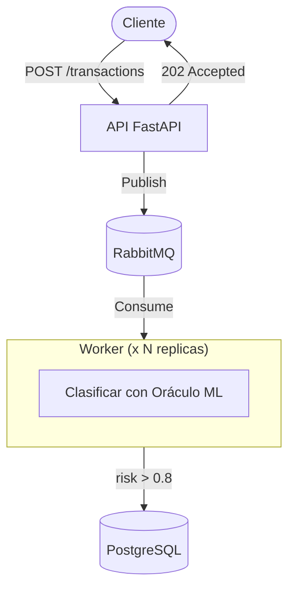

# MEMPOOL FIREHOSE


## Arquitectura



### Componentes

| Componente | Descripción |
|------------|-------------|
| **API** | Recibe transacciones y las encola. Responde `202 Accepted` de forma inmediata. |
| **RabbitMQ** | Cola de mensajes que desacopla la recepción del procesamiento. |
| **Workers** | Consumen transacciones, ejecutan el oráculo ML y persisten resultados de alta prioridad. |
| **PostgreSQL** | Almacena únicamente transacciones con `risk_score > 0.8`. |

### Flujo de datos

1. El cliente envía una transacción vía `POST /transactions`
2. La API añade a la cola el mensaje en RabbitMQ y responde `202`
3. Un worker disponible consume el mensaje
4. El oráculo clasifica la transacción y calcula el `risk_score`
5. Si `risk_score > 0.8`, se persiste en PostgreSQL

Esta arquitectura permite escalar los workers horizontalmente y desacoplar el endpoint de la carga de procesamiento de los workers.

## Ejecución de la arquitectura
Se necesita `uv` versión >= 0.9 y `docker`
### Levantar la arquitectura
1. Clona el repositorio y accede al directorio creado.
2. Crea un fichero `.env` con los contenidos de `.env.example`:
```bash
cp .env.example .env
```
3. Levanta los contenedores de PostgreSQL, RabbitMQ, FastAPI y Workers (2 instancias):
```bash
docker compose up -d --wait
```
4. Para detener los contenedores:
```bash
docker compose down
```
### Scripts para ejecutar pruebas
En las pruebas, se espera que el 20% de los resultados sean de alta prioridad ya que se ha usado una distribución uniforme para el cálculo de `risk_score`.
- Enviar 20 transacciones a `/transactions` y consultar la base de datos:
```bash
uv run scripts/verify_flow.py
```
- Prueba de estrés al endpoint `/transactions` con monitoreo de cómo se vacía la cola:
```bash
# Prueba básica, 20 requests concurrentes hasta un total de 1000.
uv run scripts/load_test.py
```
```bash
# Prueba más pesada, 50 requests concurrentes hasta un total de 5000.
uv run scripts/load_test.py --requests 5000 --concurrency 50
```
- Obtener estadísticas de la base de datos:
```bash
# Estadísticas totales
uv run scripts/query_db.py
```
```bash
# Obtener las últimas 10 transacciones
uv run scripts/query_db.py --recent 10
```

## Desarrollo en local
Se necesita uv versión >= 0.9 y `docker`
1. Clona el repositorio y accede al directorio creado.
2. Crea un fichero `.env` con los contenidos de `.env.example`:
```bash
cp .env.example .env
```
3. Instala las dependencias necesarias:
```bash
uv sync --dev
```
4. Levanta los contenedores de PostgreSQL y RabbitMQ:
```bash
docker compose -f docker-compose-dev.yaml up -d
```
5. Ejecuta las migraciones para inicializar la base de datos:
```bash
uv run alembic upgrade head
```
6. Ejecuta FastAPI en una terminal; en caso de que el puerto esté ocupado, cambia `API_PORT` en `.env` a otro puerto:
```bash
source .env && uv run fastapi dev src/api/main.py --port=$API_PORT
```
7. Ejecuta el worker en otra terminal:
```bash
uv run python -m src.worker.main
```
8. Para detener los contenedores:
```bash
docker compose -f docker-compose-dev.yaml down
```
9. Para correr los tests:
```bash
uv run pytest
```
